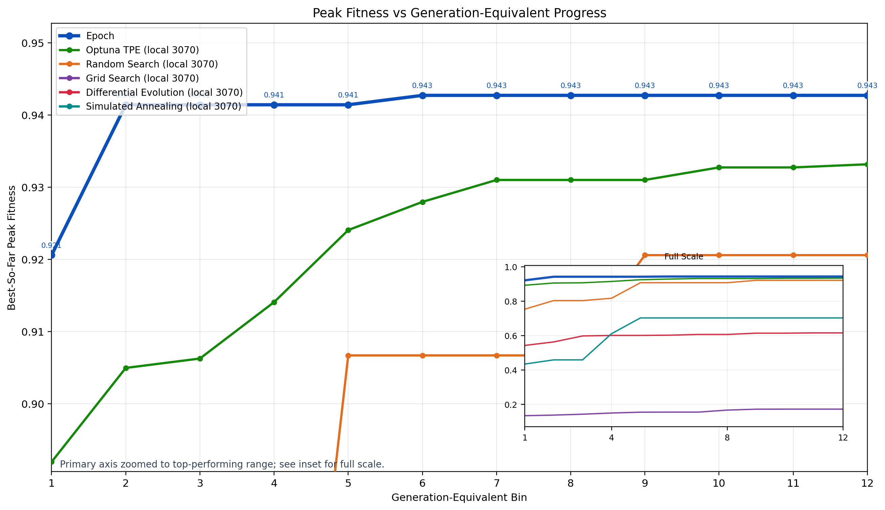
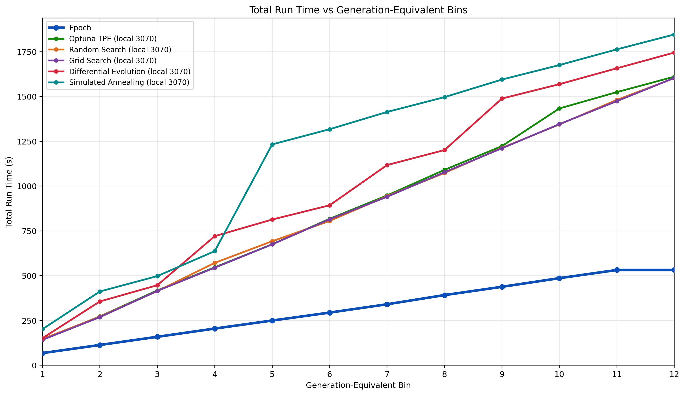
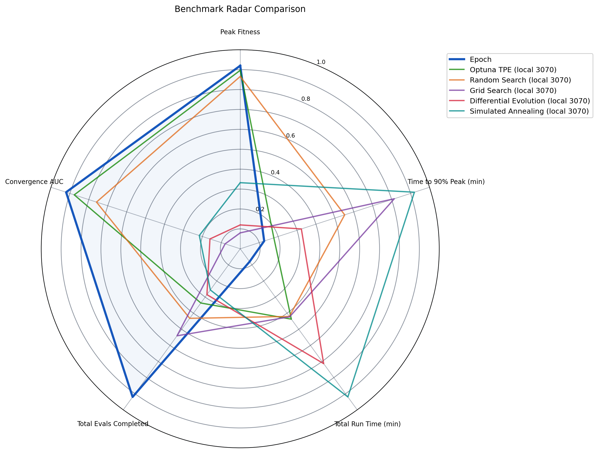

# Epoch

Epoch is a distributed hyperparameter search system for fast model-space exploration.
It combines:
- a low-latency C++ scheduler for queueing/dispatch/liveness
- a Python GA controller for generation-level search
- Python training workers that can run locally or on Modal GPUs

## What Epoch Is

Epoch is designed for high-throughput, generation-based optimization where the
search controller and scheduler remain stable while worker topology changes.
In practice, this means:
- the same scheduler/GA flow can run local-only or remote GPU fleets
- workers connect over gRPC and can be routed through a TCP tunnel
- worker count is configurable for each run (for example 10-worker and larger fleets)

For the `g12_p120` Modal baseline, scheduler dispatch latency stayed sub-millisecond
(`dispatch_latency_p90_ms = 0.103`), while processing 1,440 jobs end-to-end.

## Latest Benchmark Visuals

These charts compare `Epoch` (Modal GA reference run) against 5 local algorithms
on a 3-seed average basis, using generation-equivalent progress bins.

### 1) Peak Fitness vs Generation-Equivalent Progress


### 2) Total Run Time vs Generation-Equivalent Progress


### 3) Radar Comparison


## Benchmark Snapshot (`g12_p120` Baseline)

- Epoch (Modal reference):
  - `best_fitness_peak`: `0.942708`
  - `jobs_submitted`: `1440`
  - `wall_clock_total_s`: `531.905978` (~8.87 min)
  - `jobs_per_sec`: `46.099`
- Local benchmark setup:
  - algorithms: Random, Grid, Optuna TPE, Differential Evolution, Simulated Annealing
  - seeds: `42,43,44`
  - per-seed wall-clock target: `531.9059779640011s`
  - output: `results/local_benchmark_g12_p120`

## Quick Start

### 1) Install + generate protobuf bindings
```bash
poetry install
bash scripts/generate_protos.sh
```

### 2) Build scheduler
```bash
cmake -S . -B build -DCMAKE_BUILD_TYPE=Release
cmake --build build --target epoch_scheduler -j"$(nproc)"
```

### 3) Run tests
```bash
poetry run pytest -q
```

## Core Run Commands

### Modal GA run (distributed)
```bash
poetry run python run_ga.py \
  --mode stress \
  --pop-size 120 \
  --generations 12 \
  --max-wall-clock-s 1200
```

### Local algorithm benchmark (time-matched)
```bash
poetry run python -m benchmarks.runner \
  --space-mode stress \
  --dataset mnist \
  --seeds 42,43,44 \
  --max-wall-clock-s 531.9059779640011 \
  --budget 0 \
  --output-dir results/local_benchmark_g12_p120 \
  --train-subset-size 1536 \
  --val-subset-size 768 \
  --timeout-seconds 20 \
  --gc-every-n-jobs 3 \
  --deterministic-eval \
  --deterministic-seed-offset 0 \
  --reference-summary-path results/modal_benchmark_t4_w10/ga_benchmark_g12_p120_summary.json
```

### Generate comparison figures
```bash
poetry run python scripts/plot_benchmark_comparison.py \
  --local-per-seed-dir results/local_benchmark_g12_p120/per_seed \
  --modal-run-json results/modal_benchmark_t4_w10/ga_benchmark_g12_p120.json \
  --modal-summary-json results/modal_benchmark_t4_w10/ga_benchmark_g12_p120_summary.json \
  --output-dir results/local_benchmark_g12_p120/figures \
  --bins 12
```

## Security + Publishing

Run before push:
```bash
poetry run pytest -q
gitleaks detect --source . --verbose
```

Notes:
- `results/` is gitignored (runtime artifacts stay local).
- Keep keys/tokens/tunnel endpoints out of committed files.
- For full startup/run orchestration commands, see `startup.md`.
