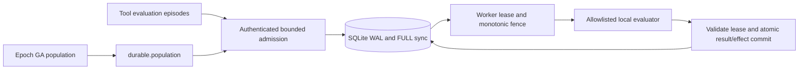

# Durable offline evaluation runtime

`durable/` adds a local execution backend to the existing C++/gRPC Epoch project.
It is useful for reproducible agent/tool episodes and restarting GA evaluations.
It does not replace the remote scheduler or claim remote fault tolerance.

```sh
python -m unittest discover -s durable/tests -v
python -m durable.experiment
```

Both commands need Python 3.10+ and its standard library only. The experiment
opens temporary databases, starts eight short-lived owned worker processes, runs
224 logical-clock fault episodes and six 256-job load trials, and exits. No
credentials, sockets, datasets, hosted model calls, or Modal accounts are used.
Review `docs/evidence/durable/manifest.json`, raw JSONL, and `summary.json`.



Job IDs hash tenant and client request key. Resubmission of identical payloads is
idempotent; changing a payload under the same key is rejected. Admission and
claims are serialized in `BEGIN IMMEDIATE` transactions. Independent global
active-job, tenant active-job, and tenant running-job limits prevent unbounded
accepted work. Expiry, cancellation, retry, and reclaims advance fencing numbers.
Database policy is persisted: new connections inherit limits, and conflicting
explicit limits are rejected. The lease/deadline clock is sampled after acquiring
the SQLite write transaction, so lock waits cannot authorize an expired lease.
An old worker cannot commit once its lease expires or ownership changes.
Terminal outcomes are succeeded, failed, and cancelled. Reads/claims perform
expiry sweeps; a stopped coordinator makes no progress until it resumes.

Results and optional effect records commit in one database transaction. Abrupt
process exit before commit rolls both back; exit after commit retains both. A
same-fence duplicate must match both result and effect exactly. This provides
exactly-once committed database effects; arbitrary HTTP calls, files, payments,
or tool actions outside this transaction need their own idempotency protocol.

`durable.adapter` executes bounded arithmetic and fixed dictionary lookups.
`task_correct` is scored independently of successful execution. It is a
deterministic infrastructure adapter, not a measured LLM agent. Tenant credentials
are supplied in memory and workers are trusted within each tenant. This local
backend has no TLS, identity provider, per-worker credentials, or public API.

The fault matrix covers success, expired leases, deadline expiry, duplicate
delivery, coordinator reopen, cancellation, and tool failure: 32 episodes each.
Logical clock expiry models worker loss. Eight additional abruptly exiting
processes exercise actual lease recovery with wall-clock timings. With eight
samples the empirical p99 equals the maximum; it is not a production SLO. Twelve unit and
integration tests include concurrent claims, wrong credentials, cross-tenant
access, forged worker identities, quota isolation, malformed payloads, renewal,
bounded retries, and abrupt exits inside/after a result transaction.
Regressions also cover write-lock contention, inherited policy, forged retry
attempt metadata and malformed admitted JSON.

The GA bridge admits individuals incrementally, including the default population
of 20 under a tenant quota of 16. `lease_seconds` defaults to 60 and `job_ttl` to
3,600; set them for the evaluator's bounded expected duration. Rejected success
or failure commits raise an explicit expiry error and remain resumable. The
bridge does not implement a heartbeat for arbitrarily long evaluations.

The load trials include admission time and commit time in observed throughput.
Four workers can regress against one for this small task because SQLite has one
writer. No network latency is subtracted and no worker multiplier is applied.
The simple retry-worker baseline is an in-memory queue without durable identity
or fencing; it is used to explain restart/duplicate behavior, not to claim a
performance advantage. WAL/FULL sync is not a power-loss proof. Active work and
payload sizes are bounded; historical rows/events require a future retention
policy for long-running use. No cleanup of user databases is included.

## Existing metric correction

`run_ga.py` metric schema 2 makes `jobs_per_sec` successful completions divided by
observed elapsed seconds. Submitted jobs per elapsed second remain
`raw_jobs_per_sec`. Worker-multiplied/network-subtracted numbers are retained as
explicitly modeled compatibility fields. They do not represent observations.
The historical README reports 1,440 submissions over 531.906 seconds, implying
2.707 submissions/s; its 46.099 figure is a model formula. The historical raw
artifacts are absent, so even 2.707 is arithmetic on reported inputs, not a new
reproduction or a successful-completion measurement. Old search-quality claims
are not revalidated by these infrastructure tests.

Cross-run ranking, reports and comparison data reconstruct successful completions
over the total observed run clock for every summary schema. They do not compare
historical modeled fields against schema-2 observed fields. Missing/invalid
successful counts or total clocks stay unknown; ranking skips them and plots
require complete observations. Submitted/returned counts are not successful counts.
The Poetry wheel includes `durable`; `python scripts/check_wheel.py` builds the
actual wheel, installs it into a fresh dependency-free environment and verifies
installed imports and the experiment CLI. CI checks this alongside the summary
consumers. Recorded artifact bytes are preserved by scoped Git attributes and
checked against their hashes in the fresh Linux checkout.
